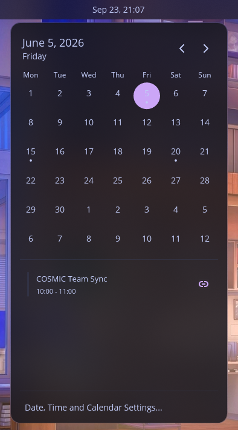
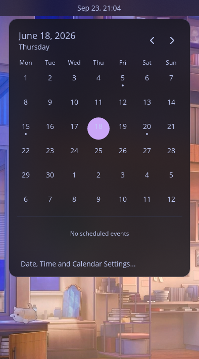
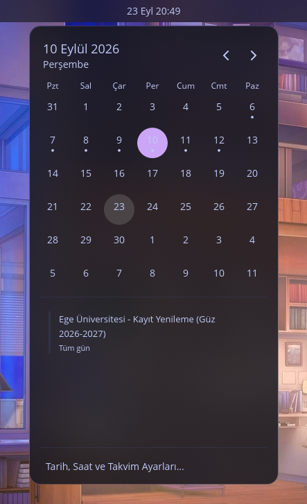

# cosmic-applet-time (with calendar events)

> [!IMPORTANT]
> **Active Development Moved:** This calendar integration has been decoupled from the 15-applet monorepo into an independent, standalone repository: [**cosmic-ext-applet-calendar**](https://github.com/Hasmolam/cosmic-ext-applet-calendar).
> Please use the new repository for lightweight installation, prebuilt binaries, and issue tracking.

A modified build of Pop!_OS `cosmic-applet-time` that adds calendar event indicators and an agenda view to the panel clock popup.

It pulls events from local `.ics` files and existing accounts configured through Evolution Data Server (EDS), without running background sync daemons inside the applet.



## Features

- **Event indicators:** Dots appear under days with scheduled events on the 42-day calendar grid.
- **Agenda panel:** Clicking a day shows scheduled events for that date, sorted chronologically with all-day events first.
- **EDS integration:** Queries existing Google, Nextcloud, or CalDAV calendars via Evolution Data Server D-Bus if configured on the system.
- **Local ICS support:** Reads holiday or calendar files placed in `~/.local/share/calendars/` (or specified by `COSMIC_CALENDAR_ICS`).
- **Meeting links:** Detects Google Meet, Zoom, and Teams URLs and provides a button to open them in the default browser.
- **Caching:** In-memory LRU cache with a 60-second TTL. Month switching is instantaneous.
- **Zero idle polling:** No D-Bus calls or background timers run while the popup is closed.
- **Localization:** English and Turkish translations included via Fluent.

## Screenshots

| Agenda with meeting link | Empty day |
| :---: | :---: |
|  |  |

| Standard event view | Turkish localization (EDS sync) |
| :---: | :---: |
|  |  |

## Installation

### Pre-built binary

The install script places the binary in `~/.local/bin/cosmic-applet-time` and restarts `cosmic-panel`:

```bash
curl -fsSL https://raw.githubusercontent.com/Hasmolam/cosmic-applets/master/install.sh | bash
```

### Build from source

Requires Rust 1.85+ and standard COSMIC build dependencies:

```bash
git clone https://github.com/Hasmolam/cosmic-applets.git
cd cosmic-applets
cargo build --release -p cosmic-applet-time
cp target/release/cosmic-applet-time ~/.local/bin/
killall cosmic-panel
```

## Uninstall

To remove the custom binary and revert to the default system clock:

```bash
rm -f ~/.local/bin/cosmic-applet-time
killall cosmic-panel
```

## Architecture

Calendar sources are decoupled behind a `CalendarBackend` trait:

- `EdsBackend`: Talks to `org.gnome.evolution.dataserver.Calendar8` over the session bus.
- `LocalIcsBackend`: Parses `.ics` files directly with a zero-dependency RFC 5545 parser.
- `CompositeBackend`: Merges and deduplicates events from multiple sources.

When the official COSMIC Accounts daemon is available in the future, a backend implementation can be plugged into this trait without modifying the UI.

## License

GPL-3.0 (same as upstream `cosmic-applets`).
